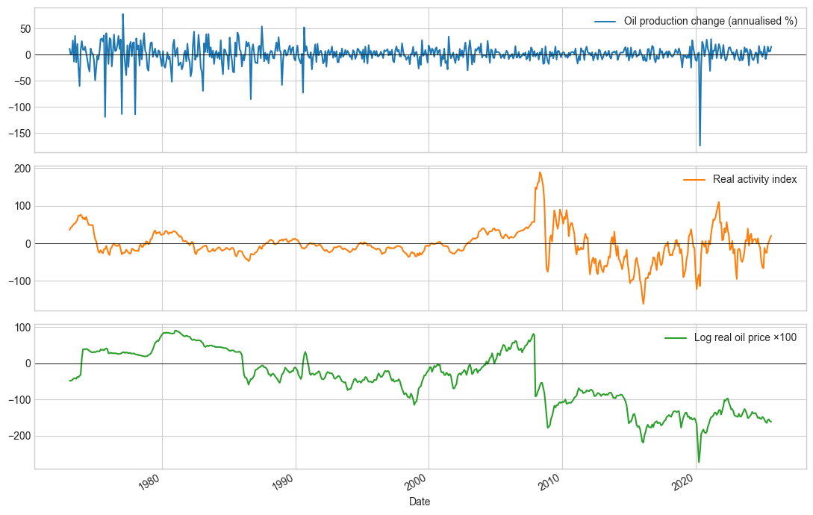
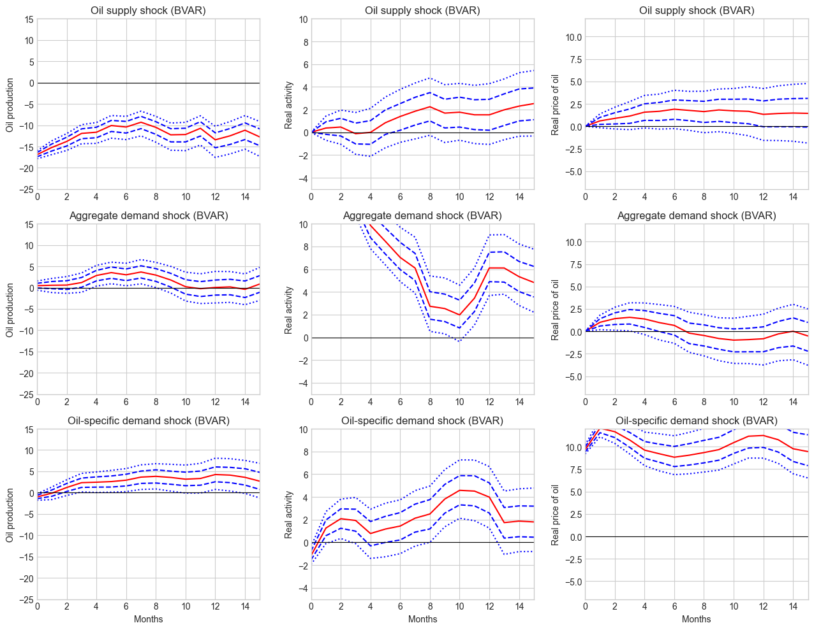
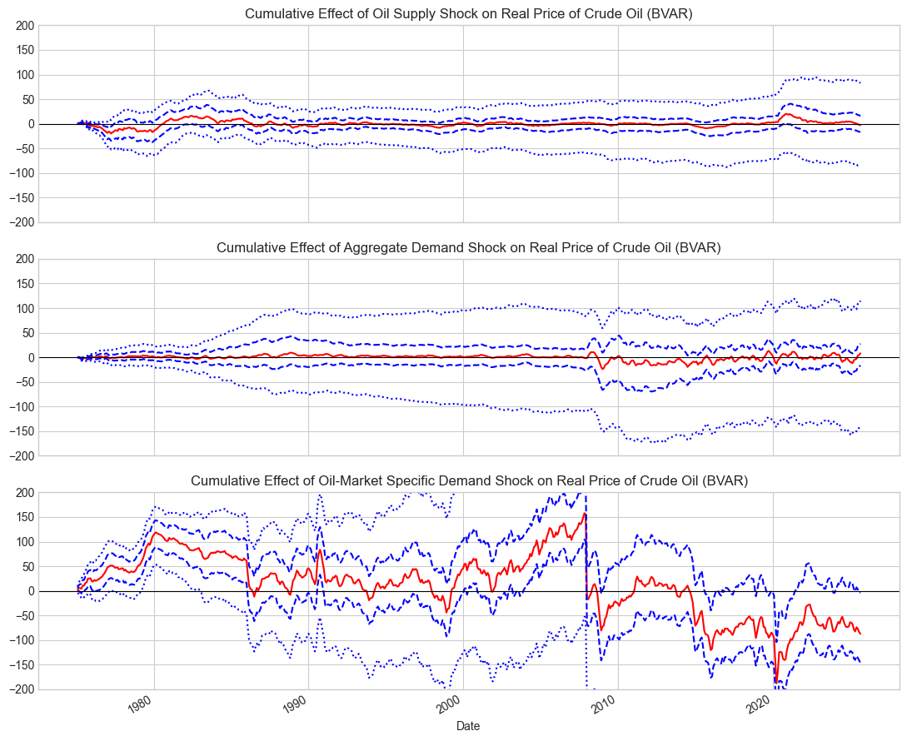

# Bayesian Time-Series Decomposition of Crude Oil Market Dynamics

**Cornell ECON 7300 — Applied Bayesian Time Series · Grade A · Spring 2026**  
**Authors:** Tony Yik-Hau Au & Merve Abaci

Empirical extension of [Kilian (2009)](https://doi.org/10.1257/aer.99.3.1053) that estimates a **Bayesian structural BVAR(24)** for the global crude-oil market and quantifies how identified oil shocks propagate to **US real GDP growth** and **CPI inflation**. Relative to the original frequentist setup, this project (i) extends the sample through **September 2025** and (ii) delivers full **posterior uncertainty** via a **Normal–Inverse-Wishart prior** and **Gibbs-sampler MCMC**.

---

## Key results

| Finding | Detail |
|--------|--------|
| **Dominant oil-price driver** | Oil-specific **precautionary demand** shocks are the main driver of real oil price movements (large, immediate, robust at 95%) |
| **FEVD (own-shock share, h = 15)** | Oil production **90.5%** · Real activity **86.5%** · Real oil price **95.7%** |
| **Macro impact** | Shock-augmented distributed-lag regressions: supply shocks → temporary GDP declines; aggregate demand → expansion then recessionary; precautionary demand → **persistent GDP decline + CPI increase** |
| **Sample extension insight** | Cumulative oil-price decomposition: precautionary demand positive and significant pre-2008 (1979, 1980–81, 2008 GFC, 2022 Russia–Ukraine), reversing negative after 2008 |





---

## Model & identification

**Endogenous variables (monthly, Kilian ordering):**

| Variable | Description |
|----------|-------------|
| `d_prod` | Percent change in global crude oil production (supply) |
| `rea` | Global real economic activity index (aggregate demand proxy) |
| `rpo` | Real oil price change factor |

**Estimation:**
- **BVAR(24)** with **NIW prior** (`V₀ = 10·I`, `ν₀ = n+2`, `S₀ = I`)
- **Gibbs sampler:** 12,000 draws, 2,000 burn-in (~10s runtime on laptop)
- **Structural identification:** recursive (short-run) Cholesky on reduced-form innovations
- **Outputs:** posterior summaries, IRFs, FEVD, cumulative-effect decomposition (68%/95% credible intervals), stage-2 GDP/CPI distributed-lag regressions

**Sample:** February 1973 – September 2025 (213 monthly obs after merging Kilian 1973–2007 data with 2008–2025 extension; truncated before October 2025 due to missing CPI during the 2025 government shutdown)

---

## Repository structure
```text
Bayesian-Time-Series-Oil-Market-Forecast/
├── Script/ # Jupyter notebooks (analysis workflow)
│ ├── kilian_07_replication.ipynb # Baseline replication
│ ├── kilian_07_bvar_niw.ipynb # BVAR + NIW Gibbs (1973–2007)
│ ├── Extend_bvar_niw.ipynb # Extended sample (2008–2025)
│ ├── Full_bvar_niw.ipynb # Full merged sample + macro stage-2
│ └── output/ # Exported HTML figures & LaTeX tables
├── data/ # Kilian + extended CSV; merged GDP/CPI series
├── output/ # Additional figures / exports
├── Report.pdf # Full project report
├── Slide_BVAR_Oil_market_shock_decomposition.pdf
└── README.md
```

---

## Requirements

**Python 3.10+** recommended.

```bash
pip install numpy pandas matplotlib scipy statsmodels jupyter openpyxl
Main dependencies: numpy, pandas, matplotlib, scipy, statsmodels
```

How to run
```
git clone https://github.com/restinghouse0203/Bayesian-Time-Series-Oil-Market-Forecast.git
cd Bayesian-Time-Series-Oil-Market-Forecast
jupyter notebook Script/Full_bvar_niw.ipynb
```

## Data sources
- Kilian (2009) oil-market variables (1973–2007)
- Extended oil variables (2008–2025), merged in data/data_extended_2008_2025.csv
- US macro series: real GDP (GDPC1) and CPI (CPIAUCSL) from FRED — merged quarterly files in data/

## References
- Kilian, L. (2009). Not All Oil Price Shocks Are Alike. American Economic Review, 99(3), 1053–1069.
- Kilian, L., & Lütkepohl, H. (2017). Structural Vector Autoregressive Analysis. Cambridge University Press.

## Author
Tony Yik-Hau Au —  [LinkedIn](https://www.linkedin.com/in/tony-au0203/) · [GitHub](https://github.com/restinghouse0203) 

Co-authored with Merve Abaci (Cornell ECON 7300, Spring 2026).
